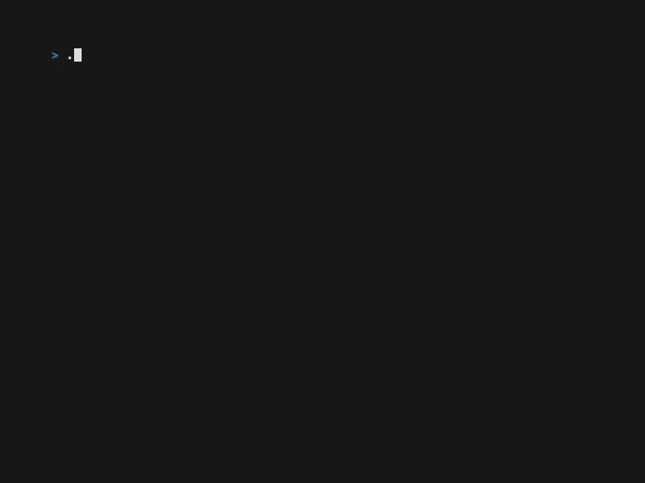

# terminal-noise

A terminal-based animated noise visualization using the OpenSimplex algorithm. Renders smooth, organic patterns as ASCII art with optional RGB color gradients.

Based on a fun idea from [Thorsten Ball's Register Spill newsletter](https://registerspill.thorstenball.com/p/joy-and-curiosity-46).



## Requirements

- Python 3.12+
- `uv` package manager

## Installation

The script is self-contained and uses `uv` to manage dependencies automatically. No separate installation is required.

## Usage

Make the script executable and run it:

```bash
chmod +x terminal-noise.py
./terminal-noise.py
```

The animation will fill your terminal window and run until you press Ctrl-C.

## Command Line Arguments

### Character Sets (`-c`, `--charset`)

- `horizontal` - Horizontal bars (default): ` ▏▎▍▌▋▊▉█`
- `mhorizontal` - Mirrored horizontal bars
- `vhorizontal` - V-shaped horizontal bars
- `vertical` - Vertical bars: ` ▁▂▃▄▅▆▇█`
- `mvertical` - Mirrored vertical bars
- `vvertical` - V-shaped vertical bars
- `simple` - Basic gradient: ` .:-=+*#%@`
- `blocks` - Block characters: ` ░▒▓█`
- `squares` - Square characters: ` ■▄▀▌▐█`
- `box` - Box drawing characters for geometric patterns
- `braille` - Braille characters (256 patterns)

### Noise Scale (`-s`, `--scale`)

Controls the detail level of the noise. Default is `0.1`.

- Smaller values (e.g., `0.05`) = more detailed, busier patterns
- Larger values (e.g., `0.3`) = smoother, flowing patterns

### Color Options

- `--color-start` - Starting color in hex format (default: `#FF1111` - red)
- `--color-end` - Ending color in hex format (default: `#11FFFF` - cyan)
- `--no-color` - Disable colors for monochrome output

### Randomization

- `--random` - Use random charset and colors with guaranteed contrast (ignores `--charset`, `--color-start`, and `--color-end`)

### Performance Options

- `--show-fps` - Display current FPS on the last line of output (rolling 30-frame average)
- `--max-fps` - Target maximum FPS (default: 120)

## Example Commands

Basic usage with default settings:
```bash
./terminal-noise.py
```

Monochrome with block characters:
```bash
./terminal-noise.py -c blocks --no-color
```

Smooth flowing animation:
```bash
./terminal-noise.py -s 0.2
```

Detailed noise with braille characters:
```bash
./terminal-noise.py -c braille -s 0.05
```

Random charset and colors (guaranteed contrast):
```bash
./terminal-noise.py --random
```

### Color Gradient Examples

Ocean theme (deep blue to cyan):
```bash
./terminal-noise.py --color-start '#000080' --color-end '#00FFFF'
```

Fire theme (red to yellow):
```bash
./terminal-noise.py --color-start '#8B0000' --color-end '#FFD700'
```

Forest theme (dark green to lime):
```bash
./terminal-noise.py --color-start '#013220' --color-end '#32CD32'
```

Sunset theme (purple to orange):
```bash
./terminal-noise.py --color-start '#4B0082' --color-end '#FF8C00' -s 0.15
```

Neon theme (magenta to cyan):
```bash
./terminal-noise.py -c box --color-start '#FF00FF' --color-end '#00FFFF' -s 0.12
```

Matrix theme (black to green with vertical characters):
```bash
./terminal-noise.py -c vvertical --color-start '#000000' --color-end '#00FF00' -s 0.08
```

Show FPS while running:
```bash
./terminal-noise.py --show-fps
```

Custom FPS target (120 FPS):
```bash
./terminal-noise.py --max-fps 120
```

## Recording Output

The animation uses ANSI escape codes, so you can record it to a file and replay it:

```bash
# Record 5 seconds of animation
timeout 5 ./terminal-noise.py > output.ans

# Replay the recording
cat output.ans
```

## How It Works

The script uses a 3D OpenSimplex noise field with dimensions (x, y, time). Each frame:

1. Multiple worker processes render frames in parallel using a frame pipeline
2. Each worker samples the noise at each terminal position for its assigned time value
3. Maps noise values (-1 to 1) to character indices
4. Optionally applies color interpolation based on noise value
5. Renders using ANSI escape codes for efficient redrawing

The time dimension increments each frame, creating smooth morphing animations.

## Performance

The application uses multiprocessing by default to achieve high frame rates:

- **50-70+ FPS** on multi-core systems (typical 4-core machines)
- **ProcessPoolExecutor** with frame pipeline for parallel rendering
- Each worker process renders complete frames at different time values
- **Buffer size = CPU count** - pre-renders frames ahead to maintain smooth playback
- Leverages OpenSimplex's idempotent nature (same seed + coordinates always produces identical output)

Performance scales with:
- **CPU core count** - more cores = higher FPS (with diminishing returns due to process coordination)
- **Terminal size** - smaller terminals render faster
- **Scale values** - larger `--scale` values require fewer noise calculations

Tips:
- Use `--show-fps` to monitor actual frame rate
- Use `--max-fps` to cap frame rate (default: 120)
- Use `--no-color` for monochrome mode (slightly faster)
- Larger `--scale` values (e.g., `0.2` or `0.3`) reduce calculations per frame
